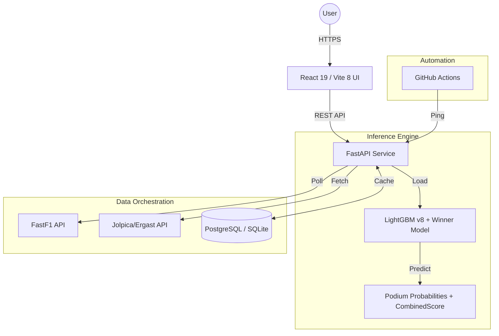

# 🏎️ F1 Podium Predictor

[](https://fastapi.tiangolo.com/)
[](https://react.dev/)
[](https://scikit-learn.org/)
[](https://vitejs.dev/)

A high-performance, full-stack machine learning application designed to predict the top 3 finishers of Formula 1 races. Built for the **2026 Season**, it leverages real-time qualifying data, historical performance metrics, and a calibrated Gradient Boosting model to provide accurate podium probabilities.

**Live Application:** [f1.aakashvijeta.me](https://f1.aakashvijeta.me)  
**API Documentation:** [api.aakashvijeta.me/docs](https://api.aakashvijeta.me/docs)

---

## 🌟 Key Features

-   **Real-Time Predictions**: Automatically triggers inference once qualifying data becomes available.
-   **Calibrated Probabilities**: Uses `CalibratedClassifierCV` to ensure the output percentages reflect real-world likelihoods.
-   **Dynamic Race Lifecycle**: A custom state machine manages transitions between `pre-qualifying`, `pre-race` (prediction mode), and `post-race` (result mode).
-   **Technical UI/UX**: Built with React 19 and an asphalt-textured aesthetic (using SVG noise filters) and high-performance technical design (Barlow Condensed typography, CSS-engineered chevron patterns).
-   **Cinematic Animations**: Utilizes **GSAP** for responsive entrance staggers, real-time probability counters, and smooth layout transitions.
-   **Season Dashboard**: Comprehensive accuracy tracking including winner hit-rates and podium success metrics across the entire 2026 calendar.
-   **Fault-Tolerant Ingestion**: Multi-stage polling of FastF1 data with completeness guards (≥18 drivers with valid data) to handle upstream lag.

---

## 🏗️ Architecture



---

## 🧠 Machine Learning Pipeline

### Feature Engineering
The model uses 15 engineered features designed to be era-agnostic, ensuring stability across regulation changes (including the 2026 reset):

| Feature | Description |
| :--- | :--- |
| **GridPosition** | Starting position on the grid. |
| **QualiGapNormalized** | Quali lap time as % of pole lap. |
| **AvgPositionGainLast3** | Rolling avg positions gained/lost over last 3 races. |
| **FinishStdLast5** | Finish position variance — consistency signal. |
| **DNFRateLast5** | Retirement rate over last 5 races. |
| **AvgFinishLast3** | Rolling average finish position. |
| **PodiumRateLast5** | Podium frequency in recent history. |
| **BeatTeammateRate** | How often driver out-finishes their teammate. |
| **CurrentSeasonAvgFinish** | Season-to-date average finish. |
| **ConstructorPodiumRate** | Constructor's podium rate. |
| **ConstructorAvgFinish** | Constructor's average finish. |
| **ConstructorDevelopmentRate** | Constructor improvement trend. |
| **TrackType_street** | Street circuit flag. |
| **TrackType_permanent** | Permanent circuit flag. |
| **RainFlag** | Wet/mixed conditions flag. |

### Model Specs
-   **Algorithm**: LightGBM (`LGBMClassifier`) with Optuna hyperparameter tuning.
-   **Calibration**: `CalibratedClassifierCV` for reliable probability scoring.
-   **Dual model**: Podium model + dedicated winner model; outputs merged into `CombinedScore`.
-   **Training Set**: 2023–2026 historical data with time-decay weighting (factor 0.38).
-   **Accuracy**: Evaluated via Brier Score Loss, ROC AUC, and Average Precision.

---

## 🛠️ Tech Stack

### Backend (Python)
-   **FastAPI + Uvicorn**: Async web framework for high-performance I/O.
-   **LightGBM + Optuna**: Gradient boosting with automated HPO.
-   **FastF1**: Real-time telemetry and qualifying/race data ingestion.
-   **Psycopg2 / SQLite**: Dual-backend DB (PostgreSQL prod, SQLite local).
-   **Joblib**: Model serialization and low-latency loading.
-   **OrderedDict TTL cache**: In-process response cache (30s / 5min / 1hr TTLs by race phase).

### Frontend (JavaScript)
-   **React + Vite**: Component architecture with HMR dev server.
-   **GSAP**: Motion design — entrance staggers, probability counters.
-   **CSS custom properties**: Asphalt-textured UI with SVG noise filters and chevron patterns.

---

## 🚀 Setup & Installation

### Backend
```bash
python -m venv sklearn-env
sklearn-env\Scripts\activate   # Windows
# source sklearn-env/bin/activate  # macOS/Linux
pip install -r requirements.txt
uvicorn main:app --reload
```

Set `VITE_API_URL` in `f1-frontend/.env` to point at your backend.

### Frontend
```bash
cd f1-frontend
npm install
npm run dev   # http://localhost:5173
```

### Training
```bash
python train.py --year 2026 --round 8   # fetch new round + retrain
python train.py --retrain-only           # retrain on existing data
python train.py --rebuild                # full rebuild from scratch
```

Model artifacts are saved to `models/` and excluded from git (`*.pkl`).

---

## 🤖 Automation & Reliability

-   **GitHub Actions**: A "Keep Alive" workflow pings the API health endpoints every 5 minutes to prevent Render free-tier spinning down during race weekends.
-   **State Buffers**:
    -   **Qualifying**: 1.5-hour buffer after session end to allow for FastF1 data processing.
    -   **Race**: 3-hour buffer post-checkered flag to absorb podium ceremonies and technical protests.

---

## 📁 Repository Layout

```text
.
├── main.py              # FastAPI entry point & orchestration
├── predict.py           # Feature engineering & inference logic
├── train.py             # ML training pipeline CLI (LightGBM v8)
├── db.py                # Database abstraction layer (PostgreSQL + SQLite)
├── routers/
│   └── results.py       # Jolpica/Ergast race results integration
├── models/              # Serialized model artifacts — gitignored (*.pkl)
├── data/                # Cleaned training dataset (2023–2026)
├── notebooks/           # Per-version training experiments
├── .github/workflows/   # CI/CD & keep-alive automation
└── f1-frontend/         # React + Vite application
    ├── src/components/  # Modular UI components
    └── src/constants/   # 2026 Season metadata & driver roster
```

---

## 📜 License & Acknowledgments

Personal project for F1 data analysis. All Formula 1 trademarks belong to Formula One World Championship Limited. Data provided by **FastF1** and the **Jolpica API**.
