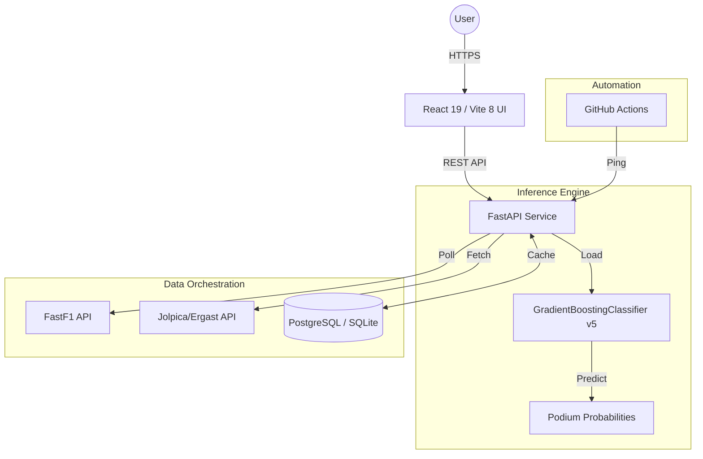

# 🏎️ F1 Podium Predictor

[](https://fastapi.tiangolo.com/)
[](https://react.dev/)
[](https://scikit-learn.org/)
[](https://vitejs.dev/)

A high-performance, full-stack machine learning application designed to predict the top 3 finishers of Formula 1 races. Built for the **2026 Season**, it leverages real-time qualifying data, historical performance metrics, and a calibrated Gradient Boosting model to provide accurate podium probabilities.

**Live Application:** [f1.aakashvijeta.me](https://f1.aakashvijeta.me)  
**API Documentation:** [api.aakashvijeta.me/docs](https://api.aakashvijeta.me/docs)

---

## 🌟 Key Features

-   **Real-Time Predictions**: Automatically triggers inference once qualifying data becomes available.
-   **Calibrated Probabilities**: Uses `CalibratedClassifierCV` to ensure the output percentages reflect real-world likelihoods.
-   **Dynamic Race Lifecycle**: A custom state machine manages transitions between `pre-qualifying`, `pre-race` (prediction mode), and `post-race` (result mode).
-   **Technical UI/UX**: Built with React 19 and an asphalt-textured aesthetic (using SVG noise filters) and high-performance technical design (Barlow Condensed typography, CSS-engineered chevron patterns).
-   **Cinematic Animations**: Utilizes **GSAP** for responsive entrance staggers, real-time probability counters, and smooth layout transitions.
-   **Season Dashboard**: Comprehensive accuracy tracking including winner hit-rates and podium success metrics across the entire 2026 calendar.
-   **Fault-Tolerant Ingestion**: Multi-stage polling of FastF1 data with completeness guards (≥18 drivers with valid data) to handle upstream lag.

---

## 🏗️ Architecture



---

## 🧠 Machine Learning Pipeline

### Feature Engineering
The model operates on 9 engineered features designed to be era-agnostic, ensuring stability across regulation changes:

| Feature | Description |
| :--- | :--- |
| **GridPosition** | The driver's starting position on the grid. |
| **QualiGapNormalized** | Qualifying lap time expressed as a % of the pole lap. |
| **MidfieldFlag** | Binary flag for P8–P15 starters (high traffic risk). |
| **AvgFinishLast3** | Rolling average finish position over the last 3 events. |
| **PodiumRateLast5** | Frequency of podium finishes in recent history. |
| **TrackType** | Circuit classification (Street vs. Permanent). |

### Model Specs
-   **Algorithm**: Gradient Boosting Classifier (Scikit-Learn).
-   **Calibration**: Sigmoid calibration for reliable probability scoring.
-   **Training Set**: 2023–2025 historical data + active 2026 updates.
-   **Accuracy**: Evaluated via Brier Score Loss and ROC AUC.

---

## 🛠️ Tech Stack

### Backend (Python)
-   **FastAPI**: Async web framework for high-performance I/O.
-   **FastF1**: Real-time telemetry and timing data ingestion.
-   **SQLAlchemy / Psycopg2**: Dual-backend support (PostgreSQL for Prod, SQLite for Dev).
-   **Joblib**: Model serialization and low-latency loading.
-   **LRU TTL Cache**: In-process memory caching for hot paths.

### Frontend (JavaScript)
-   **React 19**: Modern component architecture with concurrent features.
-   **GSAP**: Premium motion design and scramble animations.
-   **Framer Motion**: Spring-based layout transitions.
-   **Vite 8**: Ultra-fast build tool and dev server.
-   **Sharp**: On-the-fly image optimization for circuit maps and flags.

---

## 🚀 Setup & Installation

### Backend
```bash
# Initialize environment
python -m venv venv
source venv/bin/activate  # or venv\Scripts\activate on Windows

# Install dependencies
pip install -r requirements.txt

# Start development server
uvicorn main:app --reload
```

### Frontend
```bash
cd f1-frontend
npm install
npm run dev
```

---

## 🤖 Automation & Reliability

-   **GitHub Actions**: A "Keep Alive" workflow pings the API health endpoints every 5 minutes to prevent Render free-tier spinning down during race weekends.
-   **State Buffers**:
    -   **Qualifying**: 1.5-hour buffer after session end to allow for FastF1 data processing.
    -   **Race**: 3-hour buffer post-checkered flag to absorb podium ceremonies and technical protests.

---

## 📁 Repository Layout

```text
.
├── main.py              # FastAPI entry point & orchestration
├── predict.py           # Feature engineering & inference logic
├── train.py             # ML training pipeline CLI
├── db.py                # Database abstraction layer
├── models/              # Serialized model artifacts (.pkl)
├── data/                # Cleaned datasets for training
├── .github/workflows/   # CI/CD & keep-alive automation
└── f1-frontend/         # React application source
    ├── src/components/  # Modular UI components
    ├── src/constants/   # 2026 Season metadata
    └── scripts/         # Build and optimization scripts
```

---

## 📜 License & Acknowledgments

Personal project for F1 data analysis. All Formula 1 trademarks belong to Formula One World Championship Limited. Data provided by **FastF1** and the **Jolpica API**.
