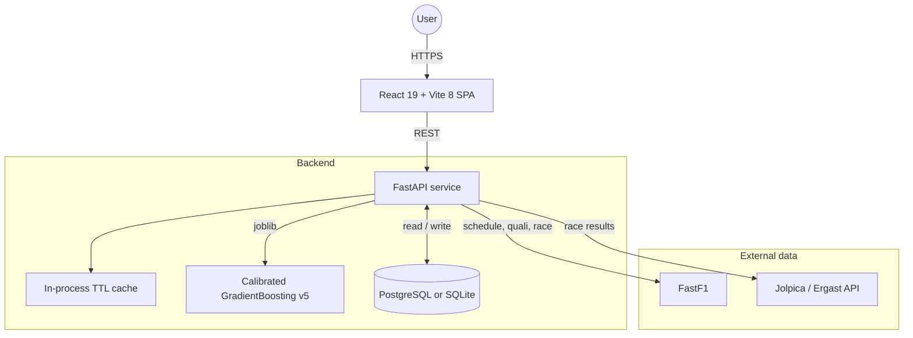

# 🏎️ F1 Podium Predictor

[](https://fastapi.tiangolo.com/)
[](https://scikit-learn.org/)
[](https://react.dev/)
[](https://vitejs.dev/)

A full-stack machine learning application that predicts the **top-3 finishers of every Formula 1 Grand Prix**. As soon as qualifying data is published, the backend runs a calibrated gradient-boosting model over the grid and serves podium probabilities for every driver. After the race, it scores its own predictions against the real results and tracks them across the season.

Built for the **2026 season** (new regulations), trained on 2023–2026 race data.

- **Live app:** [f1.aakashvijeta.me](https://f1.aakashvijeta.me)
- **API docs (Swagger):** [api.aakashvijeta.me/docs](https://api.aakashvijeta.me/docs)

---

## Table of Contents

- [Features](#-features)
- [Architecture](#️-architecture)
- [Race Lifecycle](#-race-lifecycle)
- [Machine Learning Pipeline](#-machine-learning-pipeline)
- [API Reference](#-api-reference)
- [Getting Started](#-getting-started)
- [Retraining the Model](#-retraining-the-model)
- [Configuration](#️-configuration)
- [Project Structure](#-project-structure)
- [Deployment](#-deployment)
- [Acknowledgments](#-acknowledgments)

---

## ✨ Features

- **Automatic predictions after qualifying.** The API polls FastF1 until complete qualifying data is available (≥ 18 drivers with lap times and grid positions), runs inference, and saves the result.
- **Calibrated probabilities.** Isotonic calibration (`CalibratedClassifierCV`) makes a "62 % podium chance" behave like a real probability.
- **Race-lifecycle state machine.** Every round is automatically in one of three states: `pre_quali`, `pre_race`, or `post_race`. Each state gets its own responses and cache lifetimes.
- **Season accuracy dashboard.** Winner hit-rate and podium-slot accuracy for every round, with results pulled from the database, then Jolpica, then FastF1 as fallbacks.
- **Fast, resilient backend.** Async FastAPI with an in-process TTL/LRU response cache, pooled PostgreSQL connections, timeouts and retries on upstream APIs, and short-lived caching of upstream errors so failed requests don't pile up.
- **Polished frontend.** React 19 + GSAP animations, an asphalt-textured UI built with SVG noise filters, self-hosted Barlow Condensed / Titillium Web fonts, circuit maps, and skeleton loaders.

---

## 🏗️ Architecture


```mermaid
graph TD
    User((User)) -->|HTTPS| Frontend[React 19 + Vite 8 SPA]
    Frontend -->|REST| API[FastAPI service]

    subgraph Backend
        API --> Cache[In-process TTL cache]
        API -->|joblib| Model[Calibrated GradientBoosting v5]
        API <-->|read / write| DB[(PostgreSQL or SQLite)]
    end

    subgraph "External data"
        API -->|schedule, quali, race| FastF1[FastF1]
        API -->|race results| Jolpica[Jolpica / Ergast API]
    end
```

| Layer | Technology |
| :--- | :--- |
| API | FastAPI, Uvicorn, httpx |
| ML | scikit-learn (`GradientBoostingClassifier` + `CalibratedClassifierCV`), Optuna, pandas, NumPy |
| Data | FastF1 (timing data & schedule), Jolpica/Ergast (race results) |
| Storage | PostgreSQL via `psycopg2` connection pool (production), SQLite (local fallback) |
| Frontend | React 19, Vite 8, GSAP, plain CSS with custom properties |

---

## 🔄 Race Lifecycle

`predict.get_session_status()` works out each round's state from the FastF1 event schedule:

| State | When | `/predict` behavior | Cache TTL |
| :--- | :--- | :--- | :--- |
| `pre_quali` | Before qualifying start + 1 h 30 m | Returns a "qualifying hasn't happened yet" message | 30 s |
| `pre_race` | Until race start + 3 h | Returns the stored prediction, or fetches qualifying, runs inference, and saves it | 5 min |
| `post_race` | After that | Returns the actual top 3 plus the stored prediction, backfilling either from upstream if missing | 1 h (2 min if incomplete) |

The buffers give FastF1 time to publish qualifying data and leave room for post-race penalties and protests.

---

## 🧠 Machine Learning Pipeline

### Problem framing

A **binary classification** per driver per race: `Podium = 1` if the driver finished P1–P3. Drivers are ranked by predicted podium probability, and the top three form the predicted podium.

### Features (v5, regulation-aware)

| Feature | Description |
| :--- | :--- |
| `GridPosition` | Qualifying / starting position |
| `GridPositionSquared` | Penalizes starting further back non-linearly |
| `QualiGapToPole` | Best qualifying lap minus pole lap (seconds) |
| `QualiGapNormalized` | Gap to pole as a % of the pole lap time |
| `MidfieldFlag` | 1 if starting P6–P12 |
| `AvgFinishLast3` | Driver's rolling mean finish over their previous 3 races (same season) |
| `PodiumRateLast5` | Driver's podium rate over their previous 5 races (same season) |
| `TrackType_street` / `TrackType_permanent` | One-hot circuit type |

Rolling features are shifted by one race to prevent target leakage. At inference time, the latest values for each driver come from `data/f1_dataset_clean.csv`. The file is re-read whenever its modification time changes.

### Training strategy (`train.py`)

| Split | Data | Purpose |
| :--- | :--- | :--- |
| Tune | 2023–2024 | Optuna hyperparameter search |
| Validation | 2025 | Objective: **average precision** (50 TPE trials) |
| Train | 2023–2025 | Final model fit |
| Holdout | 2026 | ROC AUC, average precision, Brier score, top-3 hit rate vs. a grid-order baseline |

- **Time-decay sample weights:** `0.38 ^ (reference_year − year)`, which weights recent seasons more heavily because of the 2026 regulation reset.
- **Calibration:** isotonic, 3-fold `CalibratedClassifierCV` around `GradientBoostingClassifier`.
- **Dataset:** about 1,700 driver-race rows (2023: 22 rounds, 2024: 24, 2025: 24, 2026: 13 so far).

Earlier experiments, including a LightGBM variant and separate winner models, are in `notebooks/` (`v6.1` → `v9`), with their artifacts in `models/`. The API currently serves **`models/model_v5.pkl`**.

---

## 📡 API Reference

Base URL: `http://localhost:8000` locally. Interactive docs are at `/docs`.

| Method | Endpoint | Description |
| :--- | :--- | :--- |
| `GET` | `/` | Service banner |
| `GET` / `HEAD` | `/health` | Lightweight health check (suitable for uptime pingers) |
| `GET` | `/schedule/{year}/{round}` | Qualifying and race start times (UTC, ISO-8601) |
| `GET` | `/predict/{year}/{round}` | Lifecycle-aware prediction / results payload (see above) |
| `GET` | `/results/{year}/{round}` | Full race classification from Jolpica |
| `GET` | `/accuracy/{year}` | Season-long winner and podium accuracy with per-round history |

<details>
<summary>Example: <code>GET /predict/2026/13</code> (pre-race)</summary>

```json
{
  "status": "pre_race",
  "predictions": [
    {
      "FullName": "George Russell",
      "PodiumProbability": 0.81,
      "WinnerProbability": 0.81,
      "CombinedScore": 0.81
    }
  ]
}
```

In v5, `WinnerProbability` and `CombinedScore` are equal to `PodiumProbability`, because a single model is used.
</details>

<details>
<summary>Example: <code>GET /accuracy/2026</code></summary>

```json
{
  "status": "ok",
  "year": 2026,
  "rounds_tracked": 13,
  "rounds_analyzed": 12,
  "rounds_pending": 1,
  "rounds_missing_results": 0,
  "podium_correct": 25,
  "total_podium_slots": 36,
  "winner_correct": 7,
  "history": [
    {
      "round": 1,
      "status": "evaluated",
      "winner_correct": true,
      "podium_hits": 2,
      "podium_total": 3,
      "predicted_top3": ["RUSSELL", "NORRIS", "LECLERC"],
      "actual_top3": ["RUSSELL", "LECLERC", "HAMILTON"],
      "result_source": "stored"
    }
  ]
}
```

The values above are illustrative.
</details>

---

## 🚀 Getting Started

### Prerequisites

- Python **3.11+**
- Node.js **20+** and npm

### 1. Backend

```bash
git clone https://github.com/AakashVijeta/f1-podium-predictor.git
cd f1-podium-predictor

python -m venv venv
source venv/bin/activate          # Windows: venv\Scripts\activate
pip install -r requirements.txt

uvicorn main:app --reload         # http://localhost:8000
```

Without `DATABASE_URL` set, the backend automatically uses a local SQLite file (`local_predictions.db`). FastF1 responses are cached in `./cache/`, so the first request for a session is slow and later ones are fast.

### 2. Frontend

```bash
cd f1-frontend
echo "VITE_API_URL=http://localhost:8000" > .env
npm install
npm run dev                        # http://localhost:5173
```

Other scripts: `npm run build`, `npm run preview`, `npm run lint`, and `npm run optimize:images` (regenerates the AVIF/WebP logos with `sharp`).

> CORS allows `http://localhost:5173` and `https://f1.aakashvijeta.me`. Edit the list in `main.py` if you serve the frontend from somewhere else.

---

## 🔁 Retraining the Model

After each Grand Prix, add the new round to the dataset and retrain:

```bash
python train.py --year 2026 --round 14   # fetch one new round from FastF1, rebuild features, retrain
python train.py --retrain-only           # retrain on the existing CSV without fetching
python train.py --rebuild                # re-fetch all of 2023–2026 from scratch (slow)
```

Each run overwrites `data/f1_dataset_clean.csv` and `models/model_v5.pkl` and prints holdout metrics and the edge over a grid-order baseline. **Restart the API** to load the new model. Updated driver form features are picked up automatically.

> **New circuit?** Add its FastF1 `Location` to the `TRACK_TYPE` dict in `train.py` and to `track_type` in `predict.py`. Unknown circuits default to `permanent`, and a warning is logged.

---

## ⚙️ Configuration

| Variable | Where | Default | Purpose |
| :--- | :--- | :--- | :--- |
| `DATABASE_URL` | backend | *(unset → SQLite)* | PostgreSQL DSN. When set, a threaded connection pool (1–5 connections, TCP keepalives) is used |
| `VITE_API_URL` | `f1-frontend/.env` | none | Base URL of the FastAPI backend |

Database tables (`predictions`, `race_results`, `qualifying_data`) are created automatically on startup.

---

## 📁 Project Structure

```text
.
├── main.py                 # FastAPI app: lifecycle routing, caching, accuracy scoring
├── predict.py              # Session status, FastF1 ingestion, feature building, inference
├── train.py                # Training CLI: data fetch → features → Optuna → calibrated model
├── db.py                   # Storage layer (PostgreSQL pool or SQLite fallback)
├── routers/
│   └── results.py          # /results — Jolpica client with TTL cache and retry
├── data/
│   └── f1_dataset_clean.csv  # Engineered training dataset (2023–2026)
├── models/                 # Serialized models (model_v5.pkl is served)
├── notebooks/              # Model experiments (main, v6.1, v7, v8, v9)
├── requirements.txt
└── f1-frontend/            # React + Vite single-page app
    ├── src/
    │   ├── App.jsx         # Race lifecycle UI + API orchestration
    │   ├── components/     # RaceHero, PodiumCards, GridTable, SeasonDashboard, CircuitMap, …
    │   ├── constants/      # 2026 calendar (rounds.js), driver roster & team colors (drivers.js)
    │   └── hooks/          # useGsap, useInView, useMotion
    ├── public/             # Fonts, logos, sitemap, robots.txt
    ├── scripts/            # Image optimization
    └── vercel.json         # SPA rewrites and cache headers
```

---

## 🌐 Deployment

- **Backend:** any Python host that runs `uvicorn main:app --host 0.0.0.0 --port $PORT` (production runs on Render with PostgreSQL). Set `DATABASE_URL`. On free tiers that sleep when idle, point an uptime monitor at `HEAD /health`.
- **Frontend:** hosted on **Vercel** as a static build (`npm run build` → `dist/`); set `VITE_API_URL` in the Vercel project's environment variables. `vercel.json` provides SPA fallback routing and long-lived immutable caching for hashed assets and fonts.

---

## 🙏 Acknowledgments

- [FastF1](https://github.com/theOehrly/Fast-F1) for timing, qualifying, and schedule data
- [Jolpica F1 API](https://github.com/jolpica/jolpica-f1), the successor to the Ergast API, for race results

This is an unofficial personal project and is not associated with Formula 1. F1, FORMULA ONE, and related marks are trademarks of Formula One Licensing B.V.
